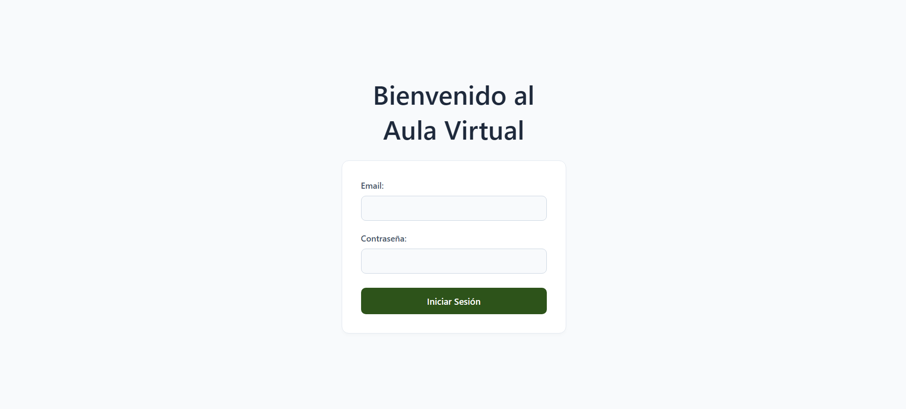
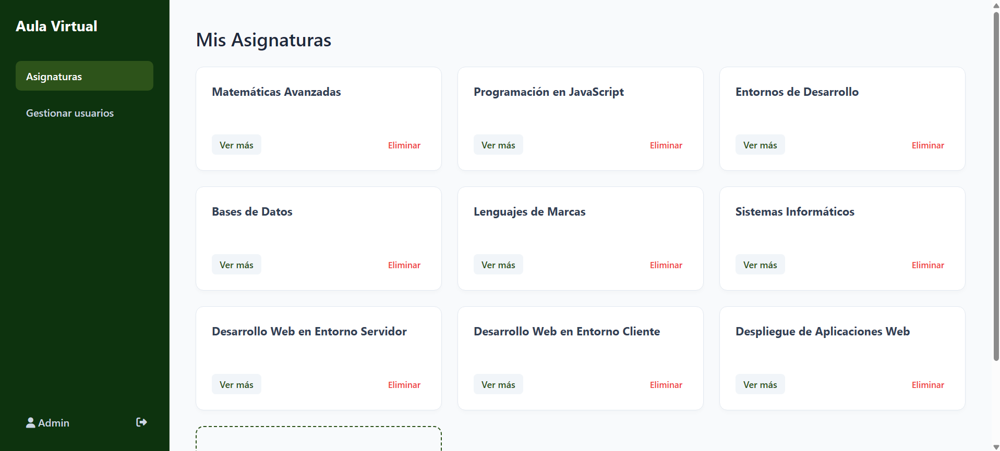
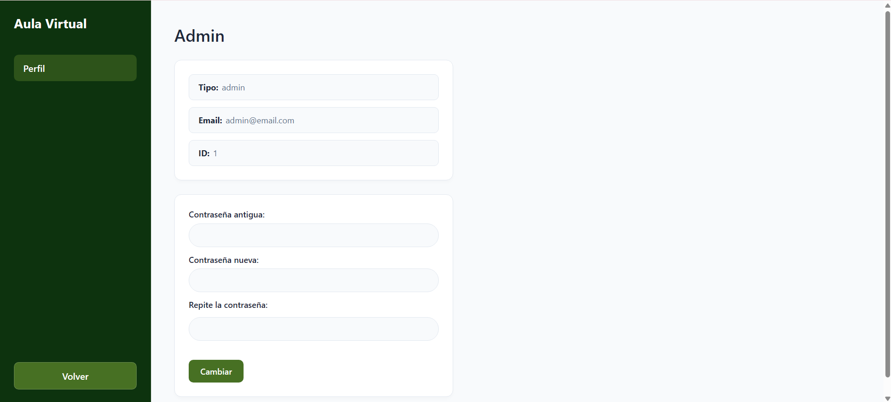
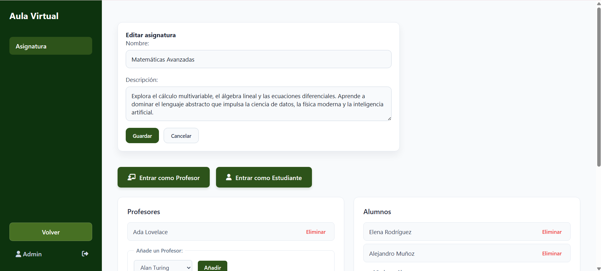
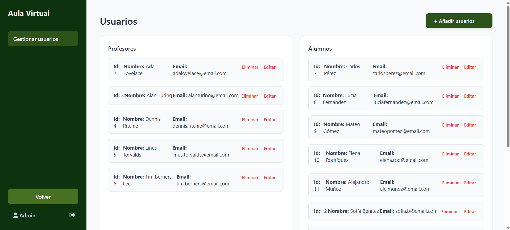
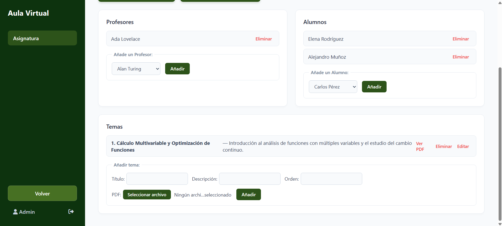
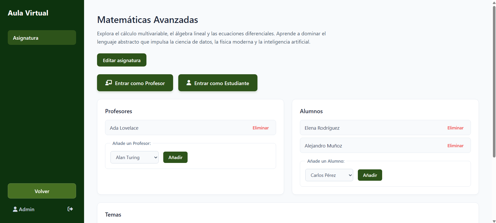

# Virtual Classroom

A web application for managing a virtual classroom environment. It allows an admin to manage users (teachers and students) and subjects, while teachers and students can view the subjects they belong to along with their topics and attached materials. It also supports joining classes virtually via video conferences.

## Features

- **Role-based access**: three user roles — `admin`, `teacher`, and `student`
- **Subject management**: create, edit, and delete subjects; add or remove users from them
- **Topic management**: add, edit, and delete topics within a subject, with optional PDF attachments
- **User management**: create and delete users; view user profiles
- **Cookie-based authentication**: sessions handled via HTTP-only cookies
- **Mustache templates**: server-side HTML rendering with `mustache-express`

## Tech Stack

- [Node.js](https://nodejs.org/) + [Express 5](https://expressjs.com/)
- [Mustache Express](https://github.com/bryanburgers/node-mustache-express) for server-side templating
- [Multer](https://github.com/expressjs/multer) for PDF file uploads
- [OpenVidu Meet](https://openvidu.io/) for per-subject video call rooms
- [Nodemon](https://nodemon.io/) for development auto-reload

## Getting Started

### Prerequisites

- Node.js v18 or higher
- npm
- [Docker](https://www.docker.com/) (required for OpenVidu)

### Installation

1. **Clone the repository**

   ```bash
   git clone https://github.com/dabediagal/proyecto-practicas.git
   cd proyecto-practicas
   ```

2. **Install dependencies**

   ```bash
   npm install
   ```

### Setting up OpenVidu

Each subject has a video call room powered by [OpenVidu Meet](https://openvidu.io/latest/meet/). You need Docker installed and the OpenVidu Meet local deployment running before starting the app.

Pull and run OpenVidu Meet:

```bash
docker compose -p openvidu-meet -f oci://openvidu/local-meet:3.7.0 up -y openvidu-meet-init
```

The app connects to OpenVidu Meet using the following environment variables (defaults shown):

| Variable | Default | Description |
|---|---|---|
| `OV_MEET_SERVER_URL` | `http://localhost:9080/meet` | Base URL of the OpenVidu Meet server |
| `OV_MEET_API_KEY` | `meet-api-key` | API key for authenticating requests |

You can override these by creating a `.env` file at the project root:

```env
OV_MEET_SERVER_URL=http://localhost:9080/meet
OV_MEET_API_KEY=your-api-key
```

### Running the app

**Development** (auto-reloads on file changes):

```bash
npm run watch
```

**Production**:

```bash
npm start
```

The server will start at [http://localhost:3000](http://localhost:3000).

## Default Seed Data

On startup the app seeds itself with demo data — no database setup needed. You can log in with any of the following accounts (all share the same password):

| Name | Email | Role | Password |
|---|---|---|---|
| Admin | admin@email.com | admin | 1234 |
| Ada Lovelace | adalovelace@email.com | teacher | 1234 |
| Alan Turing | alanturing@email.com | teacher | 1234 |
| Carlos Pérez | carlosperez@email.com | student | 1234 |
| Lucía Fernández | luciafernandez@email.com | student | 1234 |

> The admin account can see and manage all subjects and users. Teachers and students only see the subjects they are enrolled in.

## Usage Tutorial

This short tutorial explains the most common actions for using the application.

1) Sign in
   - Open `http://localhost:3000` and use the login screen to sign in with an existing account.
   

2) View subjects
   - After signing in you will see the list of subjects you belong to (or all subjects if you are an admin). Click a subject to view details and its topics.
   

3) View profile and change password
   - Access your authenticated user profile from the profile section to see your name, email and role.
   - Use the change password form to update your credentials securely.
   

4) Edit a subject (admin only)
   - On the subject view, admins will see an "Edit subject" button. Clicking it will replace the title and description with a form allowing you to modify both fields.
   - Fill in the name and description and click "Save" to submit changes via AJAX.
   

5) Manage users (admin)
   - Go to the users section to add, edit, or delete teachers and students.
   

6) Add and remove topics
   - Inside a subject you can create new topics with a title, description, order and optionally attach a PDF.
   - Teachers and admins can delete topics from the same view.
   

7) Join the virtual class
   - If a subject has an associated video room, you will find "Enter as Teacher" and "Enter as Student" links that open the external room in a new tab.
   

## Future improvements

Ideas and pending tasks to improve the application:

- Database persistence: data is currently kept in memory; add a database (SQLite, PostgreSQL, MongoDB) to persist users, subjects and topics.
- Authentication and permissions: improve with hashed passwords, more robust session handling, multi-device logout and finer-grained role permissions.
- Embedded video conferencing: instead of opening external links, embed the video experience inside the app (for example via a Web Component or an integrated client) for a smoother UX.
- File storage: use persistent storage (S3 or local service) for PDFs and serve them with access control.
- Automated tests: add unit and integration tests (Jest, Playwright) to cover routes and critical operations.
- Internationalization (i18n): support multiple languages for the interface and templates.
- UX improvements: smooth animations for forms, richer frontend validations and clearer error messages.
- Monitoring and deployment: add Dockerfiles, CI/CD pipelines and production monitoring.